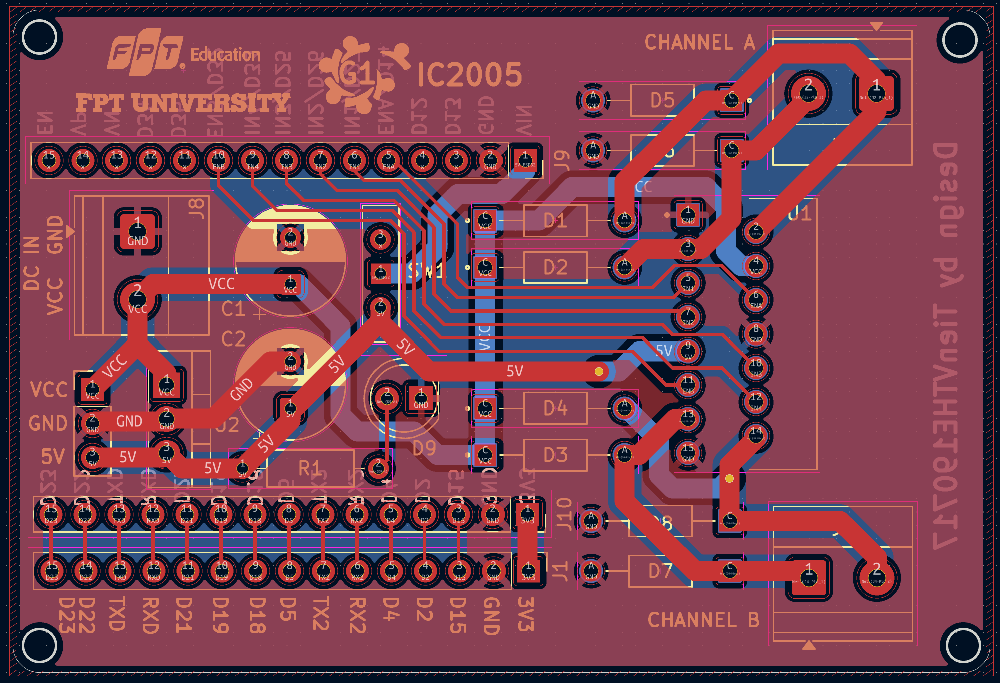
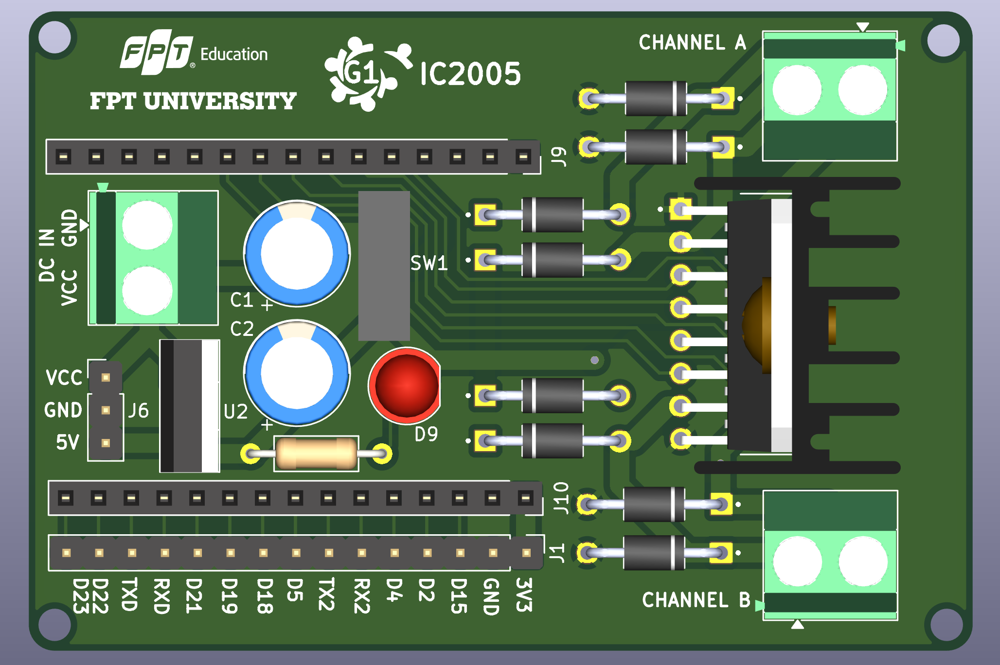
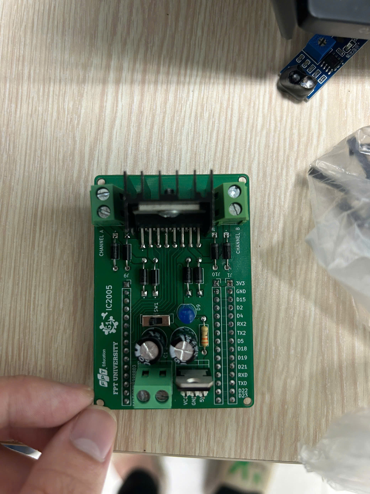
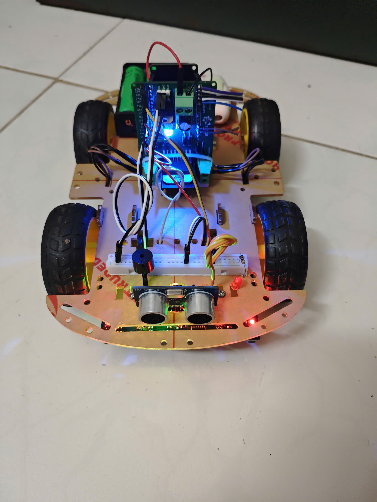
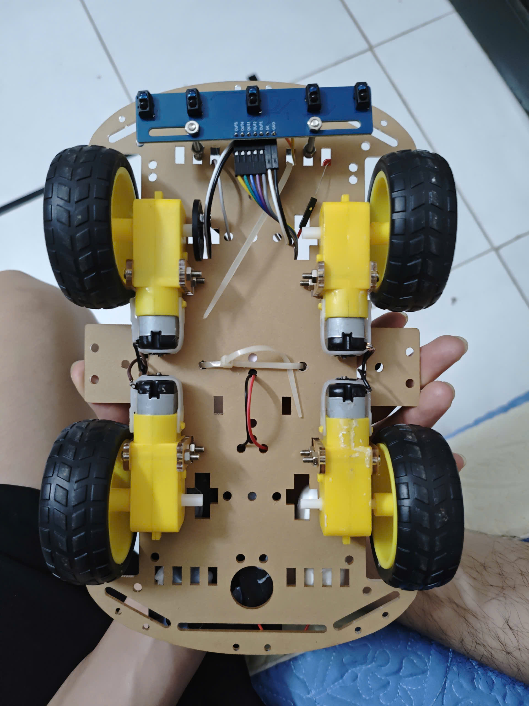

# ESP32 Line-Following Robot with Custom H-Bridge

An autonomous and Bluetooth-controlled 4WD robot featuring a custom-designed H-Bridge motor driver, ultrasonic obstacle detection, and PID-based line tracking.

## 🛠️ Hardware Overview

* **Microcontroller:** ESP32 Development Board
* **Motor Driver:** Custom-designed L298N H-Bridge PCB
* **Line Sensor:** 5-Channel IR Sensor Array (Active Low logic)
* **Obstacle Detection:** HC-SR04 Ultrasonic Sensor
* **Actuators/Indicators:** 4x DC Motors, Buzzer, LED Indicator
* **Communication:** Bluetooth Classic (`ESP32_PRO_CAR`)

## 📍 Pin Mapping

| Component | ESP32 Pin | Component | ESP32 Pin |
| :--- | :--- | :--- | :--- |
| **Motor ENA** | GPIO 14 | **Sensor S1 (Far Left)** | GPIO 17 |
| **Motor ENB** | GPIO 32 | **Sensor S2 (Mid Left)** | GPIO 19 |
| **Motor IN1** | GPIO 27 | **Sensor S3 (Center)** | GPIO 4 |
| **Motor IN2** | GPIO 26 | **Sensor S4 (Mid Right)** | GPIO 16 |
| **Motor IN3** | GPIO 25 | **Sensor S5 (Far Right)**| GPIO 23 |
| **Motor IN4** | GPIO 33 | **Ultrasonic TRIG** | GPIO 5 |
| **Buzzer** | GPIO 15 | **Ultrasonic ECHO** | GPIO 18 |
| **LED** | GPIO 2 | | |

## 📂 Project Structure

* `xe_do_line_IC2005_G1/`: Arduino source code containing the PID algorithm, Bluetooth control logic, and sensor reading functions.
* `H-Bridge Module/`: KiCad 9 hardware design files, including schematics, PCB layout, and Gerber files for manufacturing the custom motor driver.
* `images/`: Real-world photos and 3D renderings of the hardware.

## 📸 Demonstration

**Custom H-Bridge PCB Design:**

  
  
  

**Robot Assembly:**

  
  

## ⚙️ Features & Operation Modes

The system operates in two main modes, switchable via a custom Bluetooth serial application:

1.  **Line Following Mode (Mode 1):** Uses a PID control loop optimized with a dynamic time delta (`dt`) to track lines smoothly. Features pre-programmed intersection handling and step counting.
2.  **Manual / Bluetooth Mode (Mode 2):** Allows remote directional control with automatic forward obstacle detection (stops and alerts via buzzer/LED if an object is closer than 8 cm).